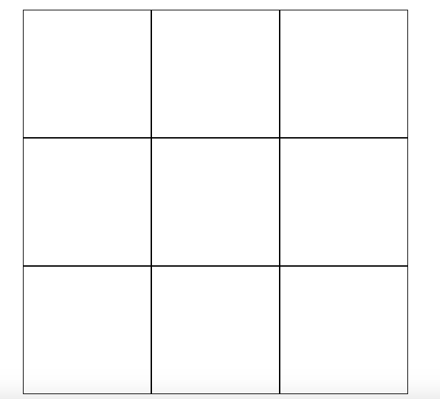
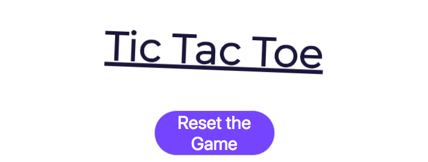
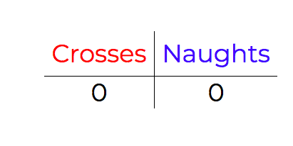
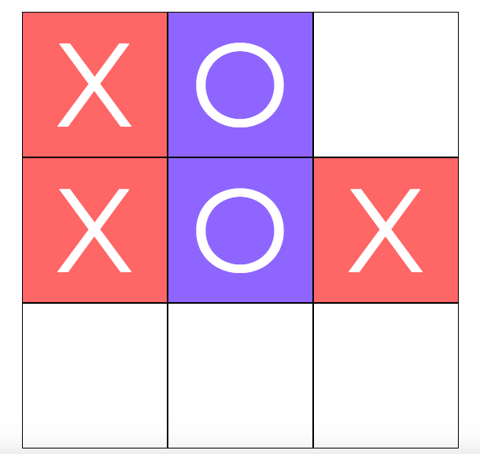
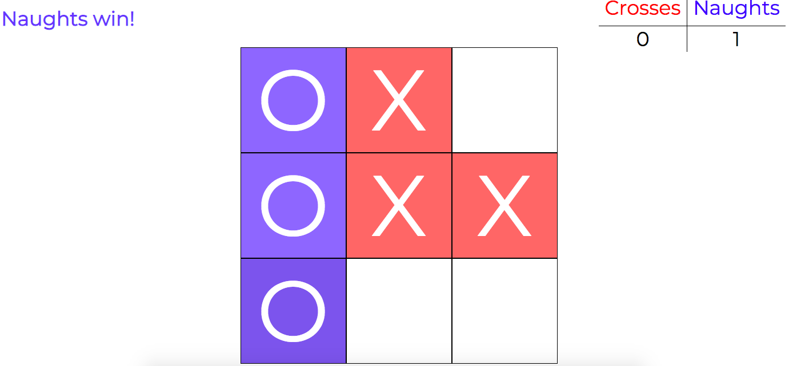
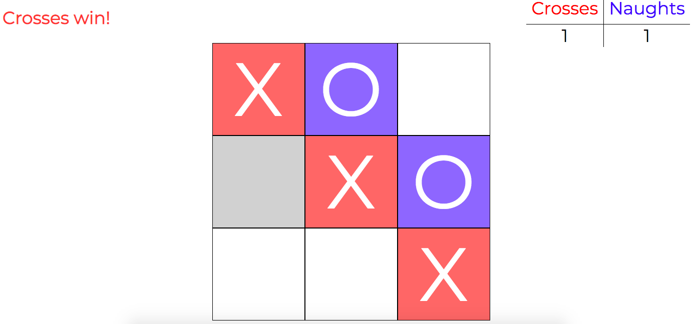

# TicTacToe

## Requirements
- [x] Create TicTacToe using jQuery
- [x] Have the correct winning winning conditions
- [x] Be able to reset the game and play again
- [x] Use event listeners in jQuery

## Content

### The Grid

The grid is created using a loop and an array. The loop assigns the array with multiple tags to create, then the array is joined and appended to the container.

### Heading and Reset button

The heading is a normal h1 tag that displays the name of the game. However, it is animated using CSS keyframes. The reset button is underneath it. It changed colour when clicked and hovered over. When clicked, it completely recreated the grid and resets the variables except for the scoreboard (See below).

### Scoreboard

The scoreboard records every time a side has won. It then retains the information until the page is completely refreshed. This is so people can play multiple games without having to keep score on their own.

### Naughts and Crosses

These are the objects that the game is played with. When on the grid, the user can click on a box and the relevant piece will display in the box. A prompt on the left hand side (above the grid) tells the user whether it is naughts or crosses turn.

## Winning conditions

If the user places their pieces 3 in a row, they will win the game and it will be displayed in the top left corner prompt. The game will not let the user place any more pieces after this and a 1 is added to the scoreboard.

